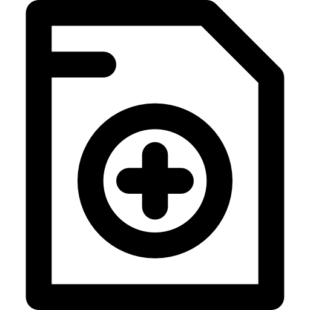
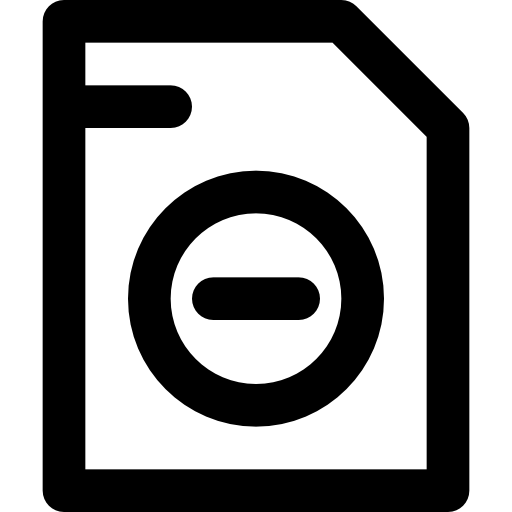
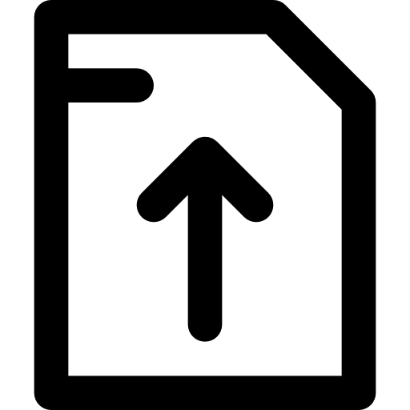
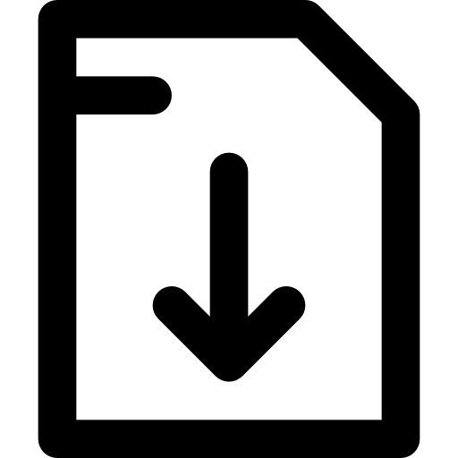
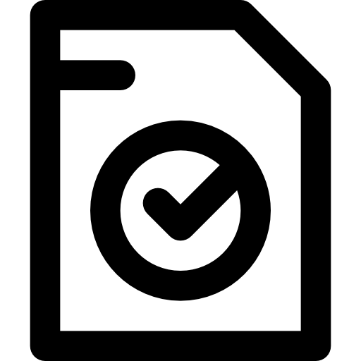
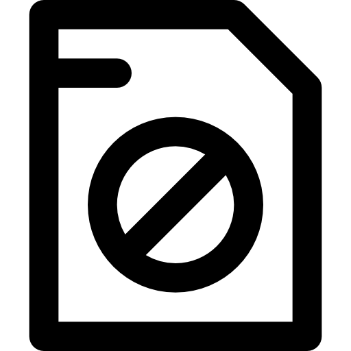
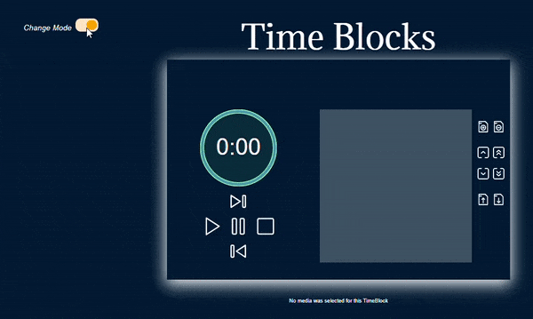

# **Time Blocks**

----

## **Inft 2063**

----

##### Thi Khanh Uyen Tran - traty145  
##### Jacob Sebastian Holdsworth - holjs005  
##### Ashley Raymond Henson - henar004  

----

# Index
1. # [Getting Started](#getting-started-1)  
   ----
1. # [TimeBlock Controls](#timeblock-controls-1)  
   ----
   1. # [TimeBlock Timer](#timeblock-timer-1)  
      ----
      - ### [Pause](#pause-pausing-timer)
      - ### [Play](#play-playing-timer)
      - ### [Previous](#previous-moving-to-previous-timeblock)
      - ### [Next](#next-moving-to-next-timeblock)
      ----
   1. # [TimeBlock List Controls](#timeblock-list-controls-1)
      ----
      - ### [TimeBlock List Selection](#timeblock-List-Selection-1)
      ----
      - ### [Add](#add-adding-a-timeblock)
      - ### [Remove](#remove-removing-a-timeblock)
      ----
      - ### [Up](#up-shifting-a-timeblock-up-one-position)
      - ### [Top](#top-shifting-a-timeblock-to-the-top)
      - ### [Down](#down-shifting-a-timeblock-down-one-position)
      - ### [Bottom](#bottom-shifting-a-timeblock-to-the-bottom)
      ----
      - ### [Import](#import-importing-timeblocks)
      - ### [Export](#export-exporting-timeblocks)
      - ### [Select All](#select-all-1)
      ----
      - ### [Done](#done-1)
      - ### [Cancel](#cancel-1)
      ----
   1. # [Light and Dark Mode](#light-and-dark-mode-1)
      ----
1. # [Media Player](#media-player-1)
   ----
   - # [Play Back Controls](#play-back-controls-1)
   ----
   - # [Play Back Options](#play-back-options-1)
      - ### [Regular Mode](#regular-mode-1)
      ----
      - ### [Presentation Mode](#presentation-mode-1)
      ----
      - ### [Discussion Mode](#discussion-mode-1)
      ----
      - ### [Collaboration Mode](#collaboration-mode-1)
      ----
      - ### [Disclaimer](#disclaimer-1)
      ----

----

   

----

# Getting Started
So you've been seeing TimeBlocks around and wondering what's up?

Have you got the [zip folder](https://gitlab.com/inft-2063-class-52617/time-blocks/-/archive/master/time-blocks-master.zip)?

[Visual Studio 2019](https://visualstudio.microsoft.com/downloads/) would be optimal to launch the application.

It is also preferable to display this in [Chrome](https://www.google.com/intl/en_au/chrome/) or ..... [Edge](https://www.microsoft.com/en-us/edge).

Okay, got all that? Good, now unzip that folder.... This might take a minute.   

Once the folder has completed unzipping, start Visual Studio 2019.  

Select **"Open a Project or Solution"**, and locate the **TimeBlock.csproj** file, and select **Load**. 

Once Visual Studio has done its thing,  
### Hit **F5** Baby, and let the good times roll! 

Located within the "server" is a file named Working.CSV, **Upload** this file to test the Media Player functionality. (Please read the [Disclaimer](#disclaimer-1) section)

[Back to Index](#index)

---

# TimeBlock Controls

----

## TimeBlock Timer
The timer is located on the left hand side of the application and the controls for it are just beneath it.

There are four buttons to control the timer:

- Pause
- Play
- Next
- Previous

----

###  **Pause** - Pausing Timer 
The pause button will stop the timer.

----

###  **Play** - Playing Timer
The play button will start the timer if it isn't already running, it will also resume the timer if it has been paused.

----

###  **Previous** - Moving to Previous TimeBlock
You can move from the currently selected TimeBlock to the previous one in the TimeBlock list with this button. It will also update the timer to display that TimeBlock. Click **Play** to resume the new TimeBlock.

----

###  **Next** - Moving to Next TimeBlock
You can move from the currently selected TimeBlock to the next one in the TimeBlock list with this button. It will also update the timer to display that TimeBlock. Click **Play** to resume the new TimeBlock.

[Back to Index](#index)

----

## TimeBlock List Controls
The TimeBlock list is located on the right hand side of the application, with the associated TimeBlock list controls located directly to the right of your TimeBlock list, and is denoted as a two by four panel of button controls.  
These controls all have tooltips attached that when hovered over, reveal what function the control relates to.

The panel consists of;

- TimeBlock Controls:
   - Add
   - Remove
- TimeBlock List Controls:
   - Up
   - Top
   - Down
   - Bottom
- Import / Export Controls:
   - Import
   - Export
   - Select All (Hidden)

### TimeBlock List Selection
You can interact with the list by clicking a TimeBlock, this will highlight the TimeBlock and enable removal or sorting.  
Subsequently clicking the same TimeBlock a second time will highlight it again, but differently, this is because this TimeBlock is inserted into the TimeBlock countdown timer, and has now become the active TimeBlock, ready at your disposal.  

[Back to Index](#index)

----

###   **Add** - Adding a new TimeBlock 
To add a new TimeBlock, simply click the **Create New** TimeBlock button, pictured above.  
You will be prompted with a popup form, asking for some details about your new TimeBlock.  
All that is required is a Name and a Length for your TimeBlock, but you can also select a media file and playback options to further enhance your experience.  
Click the **Done** button, and that is it. Watch as your TimeBlock is inserted into the TimeBlock List!

Alternatively, click the **Cancel** button to go back to the TimeBlock timer.

----

###  **Remove** - Removing a TimeBlock 
Removing a TimeBlock is even simpler! Don't like a TimeBlock? Just select your least favourite TimeBlock, and click the **Remove** TimeBlock button, pictured above.  
You will be prompted to confirm it wasn't a misclick. It happens.
Done! Watch as your TimeBlock is removed from the list.

[Back to Index](#index)

----

###  **Up** - Shifting a TimeBlock up one position 
Entered a TimeBlock in the wrong order? Switch places with the TimeBlock above it!  
Select the naughty TimeBlock and click the **Up** button, pictured above. Your TimeBlock has now shifted up in the list!

----

###  **Top** - Shifting a TimeBlock to the top 
So you you've got something super important and you wanna push it to the top off the list?  
Simply select your desired TimeBlock and click the **Top** button, pictured above.  
Your TimeBlock is now at the top of the list. 

----

###  **Down** - Shifting a TimeBlock down one position 
Meeting been pushed back? Or worse... Lunch?  
Select the TimeBlock you wish to push back, and click the **Down** button, pictured above.
Hopefully that wasn't lunch.

----

###  **Bottom** - Shifting a TimeBlock to the bottom 
Catastrophy? Really don't want to? Put it last!
Select the poor TimeBlock and click the **Bottom** button, pictured above.
I really hope that wasn't lunch!

[Back to Index](#index)

----

###  **Import** - Importing TimeBlocks 
Got some TimeBlocks you like to incorperate regularly?  
Click the **Import** button, pictured above. You will then be prompted to select as many TimeBlock CSV files as you need. Click Done.  
Watch as your list is imported into the TimeBlock list.

Alternatively, press cancel to go back.

----

###  **Export** - Exporting TimeBlocks 
You like these TimeBlocks? Alot? Export them to a CSV file!
Click the **Export** button, pictured above.  
You will notice the GUI has changed, **Import** and **Export** has been replaced by **Done** and **Cancel**, some controls have been disabled, and a **Select All** button has appeared from nowhere.  
You are now in export mode.  
Select as many rows as you like, and then click the **Done** button.
You have just downloaded all your favourite TimeBlocks!

Alternatively, click the **Cancel** button at any time to go back to the TimeBlock timer. 

[Back to Index](#index)

----

###  **Select All**
Like all these TimeBlocks but to lazy to select them all for export?  
Upon clicking the **Export** button, click the **Select All** button, click the **Done** button.  
Viola! You just exported all your TimeBlocks in three mouse clicks!

----

###  **Done**
Just a regular old **Done** button. Does **Done** button stuff, like creating, and exporting TimeBlocks. 

----

###  **Cancel**
Super boring **Cancel** button. Don't use this. Good to know what it looks like though.

[Back to Index](#index)

----

## Light and Dark Mode
###  **Change Mode**

The Toggle Button on the left hand side will enable Dark Mode of the application. 
Click that button! Now you can relax your eyes ...
If you wish to return to the regular theme, simply click it again.

[Back to Index](#index)

----

# Media Player  
The Media Player requires little effort to operate. Upon creation of your TimeBlocks specify a media file from your HDD, and your desired play back options.  
When the designated TimeBlock begins, and according to your play back selection, the selected media file will play.  
Don't worry if you can't see your video. It pops up when you press play!

## Play Back Controls
Just some standard stuff here.  
A **Play** and **Pause** button, **Volume Control** (For cranking music during your breaks! :v:), and if you hover your mouse over the video, the **Minimise** control pops up in the corner of the video. Standard stuff really. 

----

## Play Back Options

----

### Regular Mode
Just plain ol' **Regular Mode**. Your media file will play once the the TimeBlocks timer begins.

----

### Presentation Mode
**Presentation Mode** is for... Presenting... The media file will play, and upon completion, the TimeBlocks timer will being. 

----

### Discussion Mode
**Discussion Mode** is a little different. We hold the TimeBlocks timer while your media plays, but if you pause it, for say, general discussion about relevent topics portrayed in the media file, we take it out of your TimeBlock. 

----

### Collaboration Mode
Opposite day for **Presentation Mode**. Upon completion of the TimeBlock, to signify then end, the media file will commence playing.

----

### Disclaimer
Some of these features are currently not currently working 100%:
- File upload
----
   I had planned on being able to play YouTube videos and URL's, and full screen mode.
   File Upload does not work. Javascript cannot access the IO system to read file paths. Just found that out.  
   But files stored on the "server" will play.  
   There is a CSV file named Working.CSV in ~/Content/  
   This file contains links to media files contained within the "server", and provides an adequate idea of the functionality of the media player. 
- Some Play Back Options
----
   Simply ran out time.
[Back to Index](#index)

----

